# Shuttle Strikers

Shuttle Strikers is a badminton club based in Manchester. The Shuttle Strikers website is designed to provide information to prospective and existing members. Shuttle Strikers offers the opportunity for all age groups and abilities to pick up and play badminton. The site will contain information about what the club can offer its patrons, on the landing page there will also be information about meeting days and times as well as information regarding what the club can offer. A registration form will be included in the site for people who are intersted in joining. The site will be transparent regarding enrollment fees so users have all the information they need to decide if Shuttle Strikers is right for them. 

# Table of Contents
- [Shuttle Strikers](#shuttle-strikers)
- [Table of Contents](#table-of-contents)
  - [Demo](#demo)
    - [A live demo to the website can be found here](#a-live-demo-to-the-website-can-be-found-here)
  - [UX](#ux)
  - [User stories](#user-stories)
    - [Strategy](#strategy)
    - [Scope](#scope)
    - [Skeleton](#skeleton)
    - [Surface](#surface)
  - [Technologies](#technologies)
  - [Features](#features)
    - [Existing Features](#existing-features)
    - [Features Left to Implement](#features-left-to-implement)
  - [Testing](#testing)
    - [Validator Testing](#validator-testing)
      - [HTML](#html)
      - [CSS](#css)
      - [WebAim Contrast checker](#webaim-contrast-checker)
      - [Fixed Bugs](#fixed-bugs)
      - [Unfixed Bugs](#unfixed-bugs)
  - [Deployment](#deployment)
  - [Credits](#credits)
    - [Content](#content)
    - [Media](#media)

## Demo

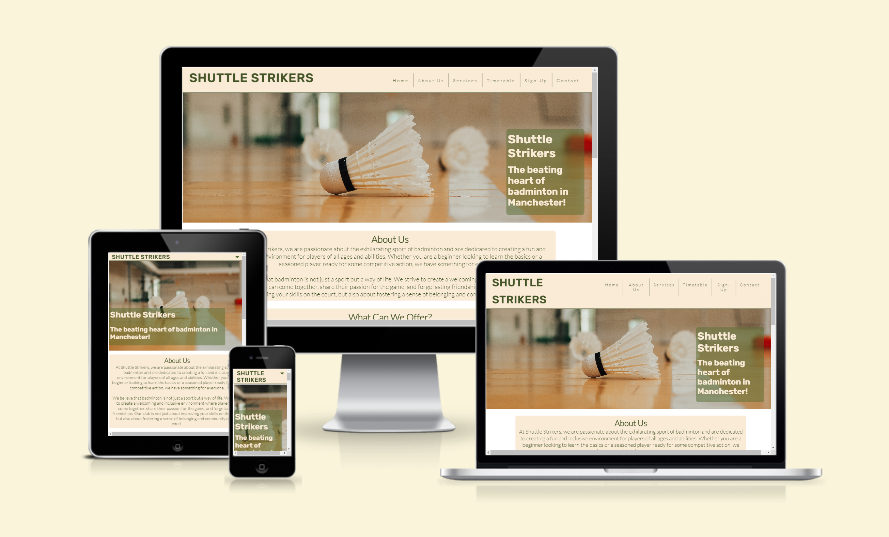

### A live demo to the website can be found [here](https://olliesharp5.github.io/badminton-club/)

## UX
There are two user groups targeted by this website. They are prosepective members and existsing ones. 
The site is focused on simplicity and ease of navigation so users can find the information they need. 

## User stories
As the sole developer of this website, my goal is to successfuly advertise the badminton club to prosepctive members as well as help establish the club in the forefront of the local community. 
I came up with the following points, which are applicable to the users:

- As a user, I want to understand the purpose of this website quickly and easily.
- As a user, I want to easily navigate this website (by using a mouse, a keyboard, or a touch screen).
- As a user, I want to see what the club can offer me
- As a user, I want to know what the club will provide me for my membersip fee.
- As a user, I want to know when the training sessions are.
- As a user, I want to know how much the memebrship fees cost. 
- As a user, I want a way to contact this club.
- As a user, I want to know where the club is located.

### Strategy
The goal is to make a well-functioning professional website for a badminton club. The focus was on making the design both user-friendly and pleasing to the eye..

### Scope
For the users, I wanted to give them a good overview of the club and its offerings, focusing on club ethos, details regarding training sessions, location and contact information. This way, the users will get a picture about what the club is about and whether they would be interested in becoming a part of it.

**Website Sections:**
1. **_Home / Landing page:_** A photo and short sentence to grab the user's attention.
2. **_About Us:_** A section which describes the ethos of the club.
3. **_What can we offer?:_** A section describing what the club can offer its patrons.
4. **_Timetable:_** A training timetable separating age groups. This is also where membersip fee prices are found. 
5. **_Training session details:_** A deeper dive into what is provided and what members will need to bring to training sessions. 
6. **_Contact Us:_** A section where we publish the address of the club as well as email and phone number. 
7. **_Map:_** This is a visual representation of where the club is located. 
8. **_Footer:_** This is not the main section of the website but rather an ending to the website with social media links. 

### Skeleton
The website is designed to be clear and simple. And the site has a simple tree structure with hierarchical flows from top to bottom.

**Wireframe**
The wireframe is designed using Balsamiq software. The first draft was edited with the guidance of the mentor.

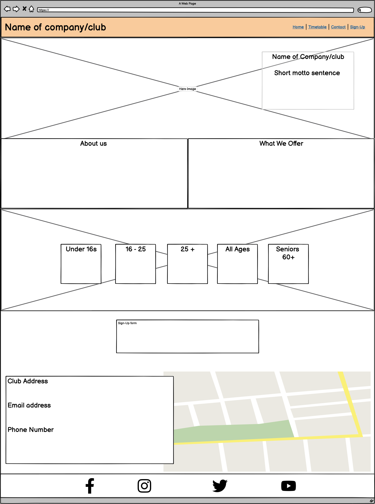

### Surface
I have selected antique white (#faebd7) and a dark green (#435426) color palette. But I also used a background image with badminton themes in 2 sections of the site. The color palette was chosen because i wanted it to represent the sophisticated and clinical nature of the sport of badminton as well as directly reflecting the colors seen on a badminton court. 

## Technologies

1. HTML - To create a basic site
2. CSS - To create a nice, standout front-end and to give a great user experience
3. Balsamiq - To create a wireframe

## Features

### Existing Features

* Navigation Bar
  
The navigation bar is an essential feature that provides easy and intuitive access to different sections of the website. For the users, it helps them easily navigate through the website and find the information they are looking for without any confusion. The navigation bar in this project has links to home, timetable, sign-up and contact. It will ensure that users can quickly find the specific information they want about the badminton club, making their browsing experience efficient and user-friendly. The navigation bar will also transform into a dropdown menu once the screen size reaches below 804 pixels wide. This has been done to conserve real estate on the page and henhance the viewing experience. 

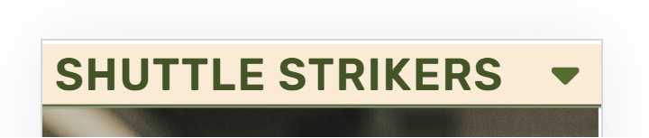

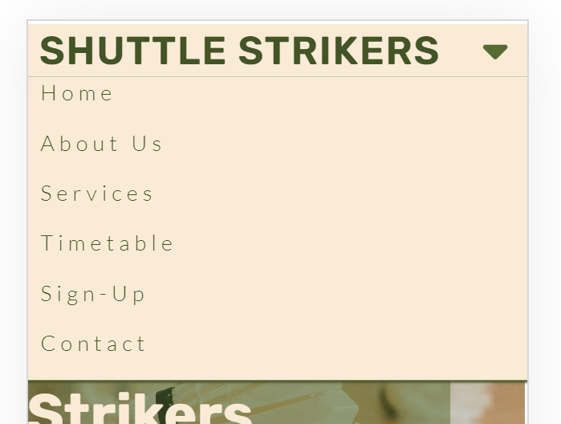

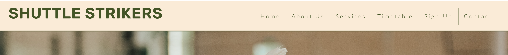

* The Landing Page Image
  
The landing page image serves as the focal point of the website and immediately grabs the attention of the users. It provides a visual representation of the badminton club, showing the main focal point of the sport. The image helps the users gauge whether the club aligns with their interests and preferences. By showcasing the club's ambiance, it allows potential members to visualize themselves being a part of the club and promotes a desire to explore further.

* Club Ethos Section
  
The club ethos section is where the badminton club communicates its values, principles, and the overall atmosphere it creates for its members. This section is crucial for users who are interested in joining the club as it gives them insight into the club's culture and what they can expect. By highlighting the club's ethos, such as promoting sportsmanship, teamwork, and personal growth, the users can determine whether the club's values align with their own. This helps them make an informed decision about joining the club and ensures that the club attracts members who resonate with their values.

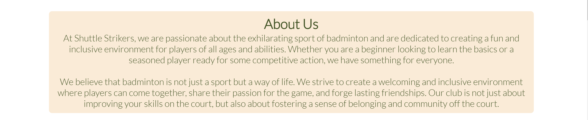

* Club Offerings Section

This section provides users with information regarding what the club can offer its members. This section isn't specific to any part of the club, it provide more of a general overview to attract prospective members. 

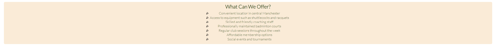

* Meetup Times section
  
This section will allow the user to see exactly when the meetups will happen, where they will be located and how long the run will be in kilometers.
This section will be updated as these times change to keep the user up to date.

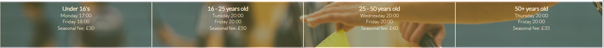

* Training Session Details
  
This section provides users with specific details regatrding the traininbg sessions. This includes what to wear, what to bring with them and how long the sessions run for. This information was necessary to implement into the site as only general information had been provided prior. The location of this section is also important as it is nested between the timetable and the registration form. 

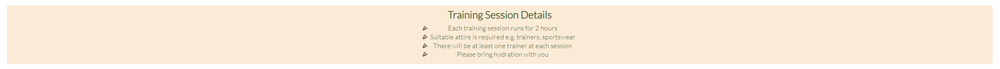

* The Sign Up section
  
The sign up page is critical for individuals who want to join the badminton club. It provides a streamlined and organized way for users to express their interest in becoming a member. By having a dedicated sign up page, users can input their personal information, specify their preferences or level of play, and indicate their availability. This helps the club in managing their membership database effectively and allows them to cater to the needs and interests of different individuals. The sign-up page is convenient for users, as they don't have to contact or communicate with the club separately, and it streamlines the membership process, facilitating a smooth onboarding experience.

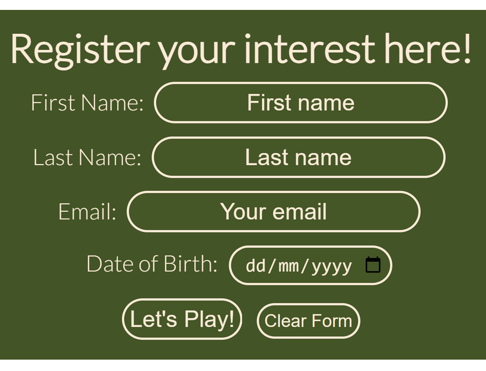

* The Contact and Map section
  
The contact and map section contains the address of the club as well as the telephone number and email address. This is paired with a visual represenattion of the clubs location in the form of a google map import. This section shpould contain all the information the user would need to contact the club and locate them. 

* The Footer
  
The footer is a consistent feature that appears at the bottom of every webpage. It provides valuable information and links that users may need to access regardless of which page they are on. In this project, the footer can include important details such as contact information, social media links, privacy policy, and terms of service. The footer ensures that users can easily find essential information without navigating back to the main menu or searching through the entire website. It increases usability, saves users time, and improves their overall experience.

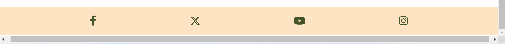

### Features Left to Implement

In the future I would like to add, 
* Another section which showcases the instructors. This could include a short bio written by each of them and photo. This increases personability of the club hopefully encouraging prospective members to register.
* A separate page where individual existing club members could reserve badminton courts outside the normal club hours. This page would include a calendar style booking platform. Additionally there would be a section displaying the rental fees per hour and any terms of conduct. This section would provide existing members with extra flexibility to practice badmintion which would hopefully be attractive to prospective members due to busy schedules.

## Testing

* I tested the site, and it works in different web browsers: Chrome, Firefox, and Microsoft Edge.
* On mobile devices, I tested the my site on a Samsung Galaxy S23 Ultra with the Samsung browser and an iPhone SE with the Safari browser.
* I confirmed that the site is responsive and functions on different screen sizes using the devtools device toolbar.
* I confirmed that the navigation and the sections Home, About Us, Services, Timetable, Sign-up and Contact are readable and easy to understand.
* I confirmed that the form works: it requires entries in every field, only accepts an email in the email field, and both the submit and reset buttons work.

### Validator Testing

#### HTML
No errors were found when passing through the official W3C validator.

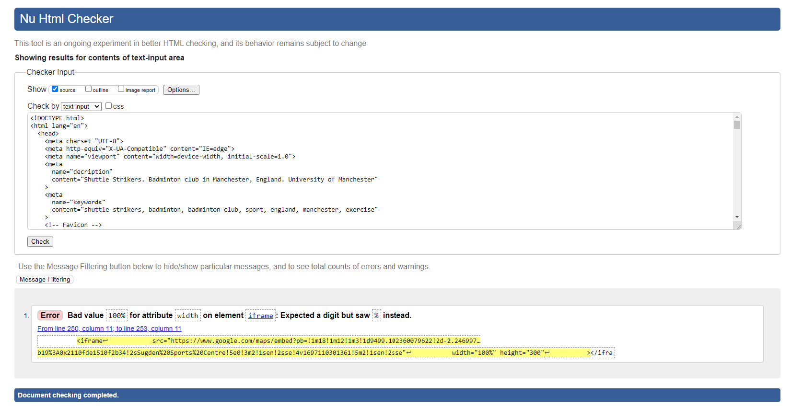

#### CSS
No errors were found when passing through the official (Jigsaw) validator.

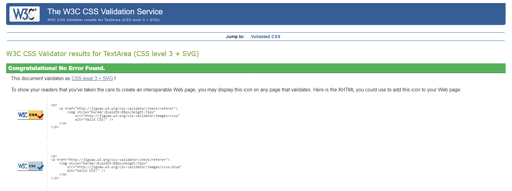

#### WebAim Contrast checker 
No errors were found when passing through the contrast validator.

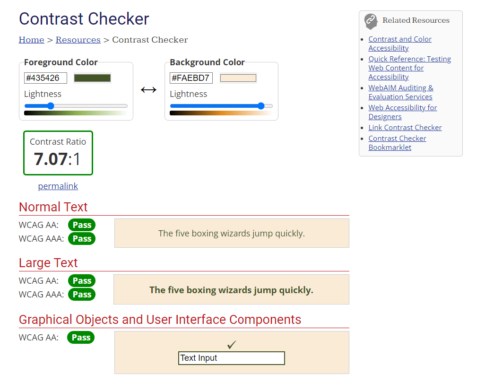

#### Fixed Bugs

* The header element was dissapearing when the page was scrolled - this was resolved with assistance of my mentor who advised to use scroll-padding to the body element.  
* Some navigation elements were hidden from view widths of 804px -  998px - this issue was rellved by amending the media queries to compensate for the additioanl navbar elements.
* Hero image and background image wasnt displaying on my deployed site - this was resolved by amending the file paths. 
* An error was appearing with the iframe when running through the HTML validator. The solution was to create a class and style the iframe in css instead. 

#### Unfixed Bugs

* The view from the Samsung Galaxy Fold creates a margin down the right hand side of the page which means some text spills over their containers. 

## Deployment

* The site was deployed to Git Hub pages using the following steps:
  - In the Github repository, the Stetting tab.
  - Under General, navigate to Code and Automation and select 'Pages'.
  - In the Build and Deployment section for Source, select 'Deploy from a branch' from the drop-down list.
  - For Branch, select 'main' from the drop-down list and Save.
  - On the top of the page, the link to the complete website is provided.
  
* The deployed site will update automatically upon new commits to the master branch.

## Credits

### Content

* The text for the About Us and What Can We Offer section was generated using the OpenAI tool ChatGPT.
* Instructions on how to target the placeholder in the form was taken from https://www.w3schools.com/cssref/sel_placeholder.php#:~:text=The%20%3A%3Aplaceholder%20selector%20selects,value%20of%20an%20input%20field.
* Instructions on how to implement the navigation bar dropdown toggle was taken from the Love Running tutorial during my Code Institute course.
* The idea for the style of the timetable was inspired by the Love Running project during the code institute curriculum. 
* The responsiveness of the text over the hero image was inspired from the love running project during the code insitue curriculum.
* The idea to implement scroll-padding was provided by my mentor. 

### Media

* The icon used for the favicon is from favicon.io
* The photos used on the landing page are from pexels.com
* The images used for the shuttlecock icons are from flaticon.com
* The icons in the footer were taken from Font Awesome